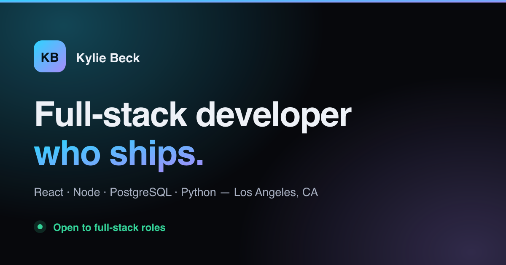

# Kylie Beck — Portfolio

Personal portfolio site. Single-page React app with a dark-first design system,
a light theme, scroll-triggered section reveals, and a fully responsive layout.

**Live site:** _add your deployed URL here_



## Stack

| | |
|---|---|
| Framework | React 19 |
| Build | Vite 7 |
| Routing | React Router 7 |
| Styling | Plain CSS with custom properties — no framework |
| Lint | ESLint 9 (flat config) |

## Running locally

```bash
npm install
npm run dev      # dev server with HMR
npm run build    # production build to dist/
npm run preview  # serve the production build
npm run lint     # eslint
```

## How it's put together

```
src/
  index.css              design tokens (color, type scale, spacing) + base layer
  App.jsx                page composition and legacy-route redirects
  hooks/
    useTheme.js          theme state, mirrored to <html data-theme> + localStorage
    useRevealOnScroll.js one page-wide IntersectionObserver drives every reveal
  components/
    Navbar.jsx           sticky nav, scroll-spy, mobile drawer
    Hero.jsx             Projects.jsx  Skills.jsx  Experience.jsx  Contact.jsx  Footer.jsx
    css/                 one stylesheet per component
```


